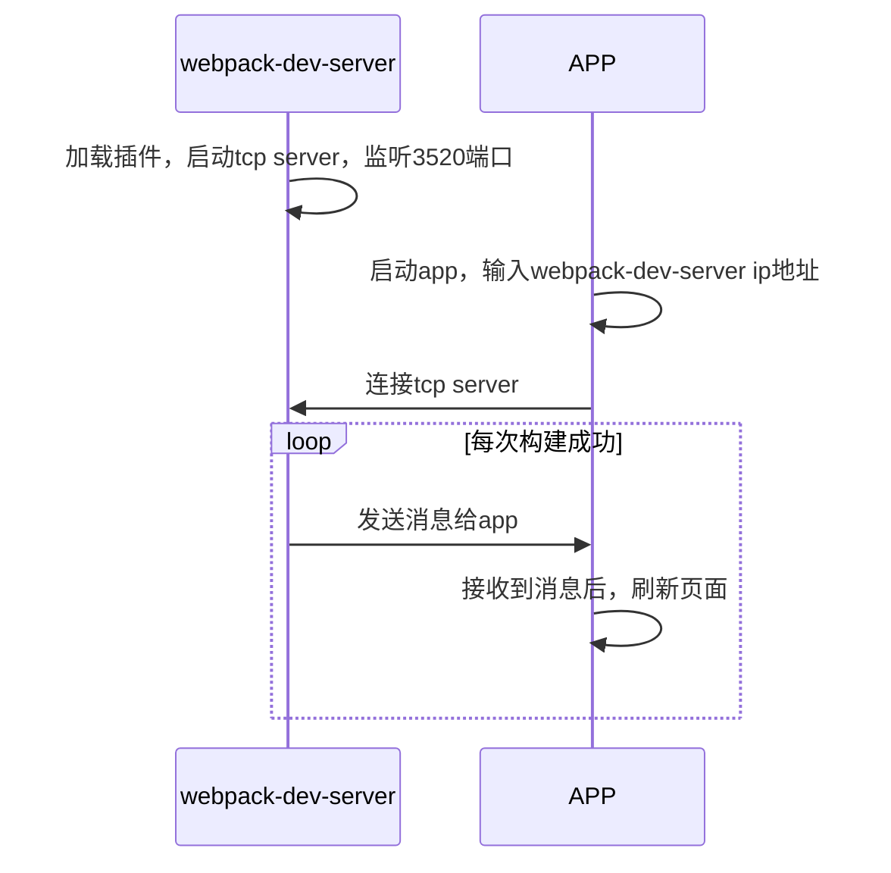

## 1. 快速上手
### 1.1 项目地址

> https://github.com/ali-kos/kos-scaffold-mobile1-javascript

> 开发分支: develop

### 1.2 目录结构规范
+ config: webpack配置及npm脚本
+ public: 静态html模板文件
+ lib: 对kos封装的工具
+ src: 项目中所有 JS 源码应当存放在此目录下，且所有JS文件编写应当遵循Javascript 编码规范.

  + app: 暂时空置

  + common: 目录下存放项目公用的方法等

  + component目录下存放项目共用的模块和组件

  + pages目录存放具体的业务模块

  + main.js 主入口
  
  + router.js 根路由文件
### 1.3 开发调试
安装项目依赖的npm模块
```
npm install
```

一键启动调试，访问 http://localhost:8099/ 查看效果。
```
npm start
```

构建和部署
```
npm run build
```
## 2. 基本概念


> Model： Model是KOS的一个核心概念，Model承载View的数据提供、各类数据操作逻辑，扩展中间件时，需要使用到的基础配置，也将在Model上承载

> View： 经过kos.Wrapper包装后返回的组件，称之为view，本质上也是一个React.Component

> Wrapper： 高阶函数，第一级别参数为config，第二级参数为一个React.Component包裹器，返回一个高阶组件将Model和View做了糅合

> Middleware： Redux的中间件，详见Middle，kos基于redux的中间件来扩展自己的能力

> namespace： 命名空间，View和Model要整合，namespace是必须的，

> namespace的几个用处：
  1. 用于在store.state中开辟数据存储空间；
  2. 用于标志具体的action将由哪个Model来处理；
> namespace的配置方式：
  1. 通过Model.namesapce配置
  2. 通过config.namespace配置
  3. 通过View的props传入，<View namespace="abc"/>
> 优先级：
model.namespace > config.namespace > view.namespace


## 3. 配置示例
#### 3.1 编写model文件
> Model是View的控制器，提供View的数据源、数据操作响应（同步action，异步action）、初始化数据加载能力、表单校验和表单字段控制能力，基于kos的扩展能力redux中间件扩展所需要的配置，也将在model上承载

代码示例：

```js
const Model={
  namespace:'kos-test',
  // state的初始化数据
  initial:{
    counter:0,
    title:'KOS-Test'
  },
  // 用于处理数据变更的同步的action
  reducers:{
    setTitle(state, action){
      const { title } = action.payload;
      return {
        ...state,
        title
      };
    }
  },
  // 用于处理异步的action
  asyncs:{
    async loadInitData(dispatch, getState, action){
      ///...
      const state = getState();
      setTimeout(()=>{
        dispatch({
          type:'setState',
          payload:{
            count: state.count++
          }
        });
      },1000)
    }
  },
  // 页面初始化会调用
  async setup(dispatch, getState, action){

  }
}

export default Model;
```

说明：
- 1). namespace
类型：string，
说明：namesapce是用来区分不同Model和组件的唯一标识，不能重复，封装后的组件将使用store.getState()对象下的namespace一级的数据
- 2). initial
类型：Object
说明：提供初始化的默认数据
- 3). reducers
类型：Object
说明：提供处理同步action的逻辑，key为action.type
注入默认的reducers：

- 4). setState
说明： setState会将payload提供的数据与state进行merge;

代码示例
```js
this.props.dispatch({
  type:'setState',
  payload:{
    name:'test1'
  }
});
```

- 5). reset:将model.initial下的数据，覆盖store.getState()[namespace]的数据，默认componentDidMount的时候，会出发该action

代码示例
```js
this.props.dispatch({
  type:'reset',
});
```
- 6). setup：加载初始化数据时，执行的action，WrapperComponent会根据Wrapper(config)的autoLoad来确定，是否需要执行

#### 3.2编写view文件
> 我们在kos wrapper的基础上结合路由进行了再次封装，详情见（src/components/AutoWrapper）

@AutoWrapper({config:{model,autoLoad:true,autoReset:true}, router:[] })
  1. AutoWrapper需要config : Object和router: Array;均为可选参数

config配置项：
  1. config需要绑定的model:必选;
  2. autoLoad非必选, componentDidMount时是否触发model.setup函数加载组件的初始化数据, 默认为true;
  3. autoReset非必选, componentWillUnmount的时候是否清空model中的数据, 默认为true;

router配置项
  1. 可选项，类型要求为数组(经优化, 该文件可以为空)

```js
import LoadableComponent from '@/components/LoadableComponent';
// 懒加载模式
const Analysis = LoadableComponent(() => import('./Analysis'));

export default [
  {
    path: '${parentPath}/analysis/:id', // 路由参数, 支持传参
    Component: Analysis,
    icon: 'appstore',
    name: '模块1' // titlebar显示
  }
];
```


view代码示例：

```js
// index.js
// 友情提示: index.js文件目前固定为如下写法. 具体业务在子路由中实现.
import React from 'react';
import { AutoWrapper } from '../components/AutoWrapper';
import router from './router';

@AutoWrapper({ router })
export class Main extends React.PureComponent {
  render() {
    return (
      <div>{this.props.routers}</div>
    );
  }
}
```

4. 文档参考 

kos-doc：[https://ali-kos.github.io/kos-docs/](https://note.youdao.com/)


## H5调试相关

> 由于h5页面依赖原生提供的jsapi，推荐在真机做页面预览和调试。

### 1. 真机预览页面

#### 原理



#### 步骤

1. 配置webpack插件

加载plugin-native-debug.js的插件
``` 
const NativeDebugPlugin = require('./plugin-native-debug');

plugins: [
    new NativeDebugPlugin({options: true})
],
```

2. 配置webpack-dev-server

启动webpack-dev-server需要添加host选项，使真机可以正常访问到webpack-dev-server

package.json
```
"scripts": {
    "start": "webpack-dev-server --host 0.0.0.0 --inline --color --progress --config config/webpack.dev.config.js",
  },
```

3. 安装apk

安装内置h5容器的apk，当前项目就是供应链app apk
> 安装方法：可以利用第三方安装工具，或者把apk放在httpserver中，通过下载安装。

4. 启动webpack-dev-server
```
npm start
```

5. 启动应用，连接webpack server 

启动app，在出现首页后，提示输入webpack-dev-server的ip时，输入对应并点击确定


### 2. 真机调试

1. 开启手机中的usb调试模式
> 1. 设置-开发者选项，打开“开发者选项”，打开“USB调试”。
> 2. 特殊的，如果设置中没有开发者选项，在设置-关于手机中，连续点击版本号，等出现已开启开发者模式的提示，就能在设置中找到“开发者选项”。如果上述方法还不能开启，请自行查询对应手机型号的开启方法。
> 3. 通过数据线把手机连接到pc。如果手机中弹出允许访问设备的对话框，请允许。

2. 安装apk

3. 打开chrome的inspect-devices工具
> 多种打开方法：
> 1. 直接地址栏输入 chrome://inspect/#devices
> 2. 打开dev-tools,选项more-tools中选择remote devices

4. insepct-devices中选择用于调试手机

5. 再选择调试用的应用，并点击inspect，即打开调试页面。
> 如果调试页面出现白屏，或者404错误，请尝试翻墙后再启动inspect。


